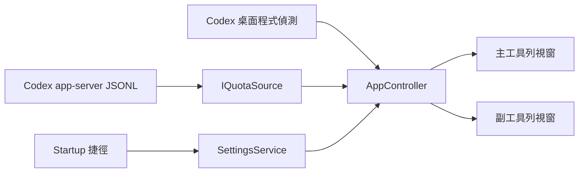

# 開發指南

## 架構



`CodexHpBar.Core` 包含額度模型、容錯解析與純邏輯；WPF 專案負責程序、Win32、設定與繪製；測試專案只依賴核心程式庫。

## 建置

```powershell
dotnet restore CodexHpBar.slnx
dotnet build CodexHpBar.slnx -c Release
```

## 測試與格式

```powershell
dotnet format CodexHpBar.slnx --verify-no-changes
dotnet test CodexHpBar.slnx -c Release
powershell -ExecutionPolicy Bypass -File .\scripts\validate.ps1
```

## UI 示範

```powershell
dotnet run --project .\src\CodexHpBar -c Release -- --demo dual
```

## 發布

```powershell
powershell -ExecutionPolicy Bypass -File .\scripts\build-release.ps1 -Version 0.2.0
```

腳本會產生 self-contained single-file EXE、可攜版 ZIP 與 SHA-256。

## 提交規範

提交訊息遵循 Conventional Commits 1.0.0，標題與本文使用繁體中文。功能提交範例：

```text
feat(app): 新增 Codex 額度工具列監測器

- 新增 app-server 額度來源與雙工具列視窗。
- 加入可攜版發布及繁體中文文件。
- 完成單元、整合與封裝測試。
```
